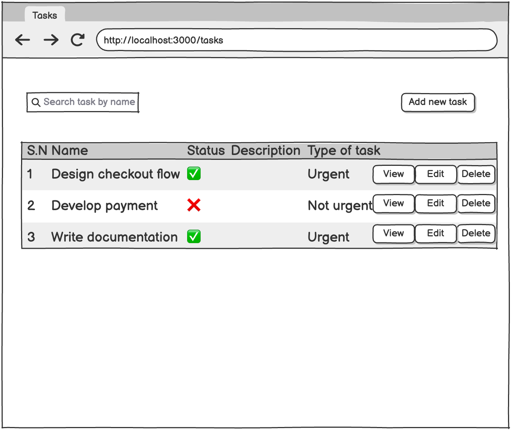
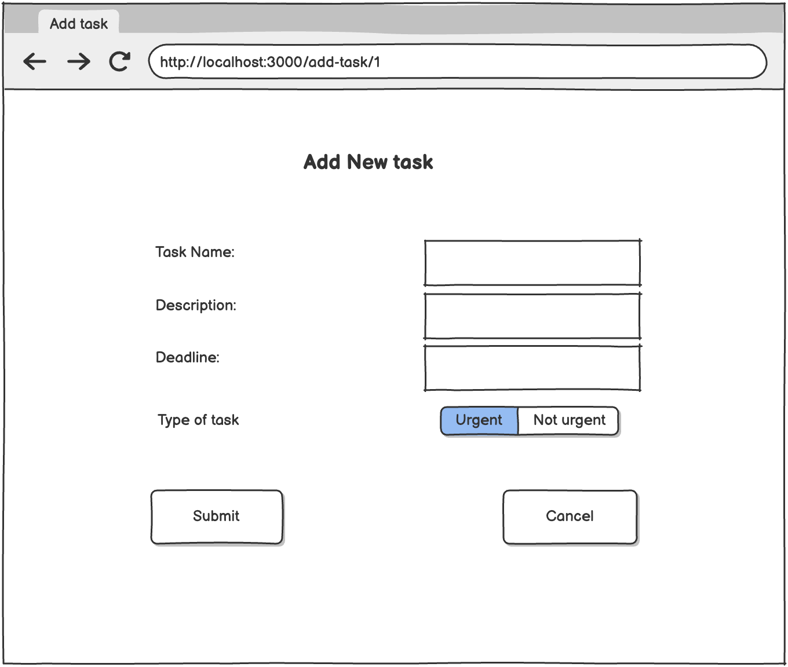
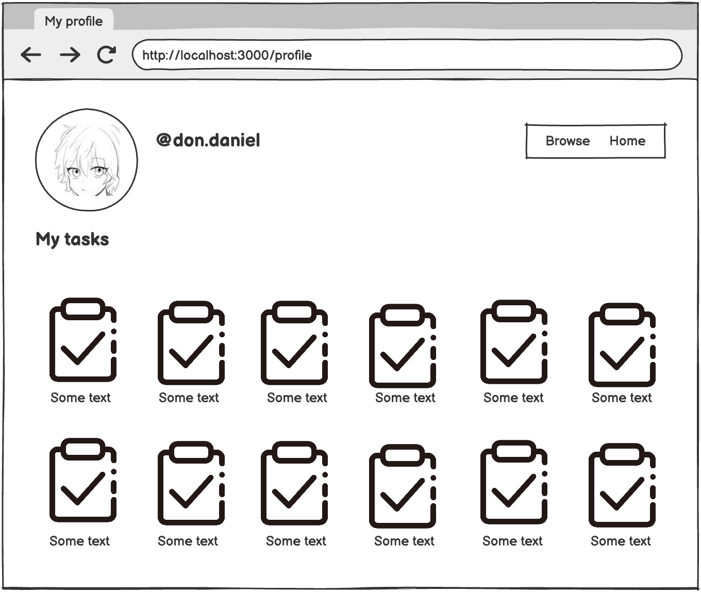
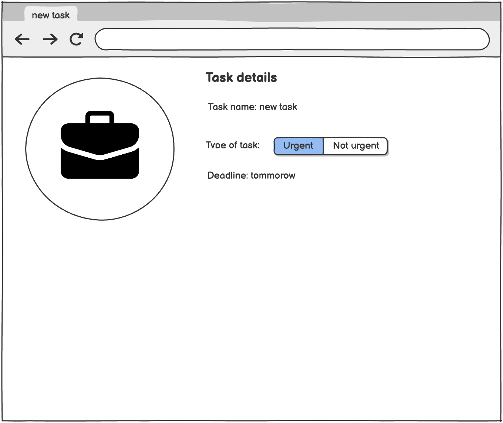

# Техническая документация: Проект "Менеджер Проектов"

## 1 Введение
---
### 1.1 Контекст проекта
Проект "Менеджер Проектов" представляет собой веб-сервис для управления проектами и задачами, ориентированный на команды разработчиков, менеджеров и фрилансеров, которые координируют работу над задачами. Приложение позволяет пользователям создавать проекты, добавлять задачи, отслеживать их выполнение и просматривать списки проектов с деталями. Административная панель позволяет управлять проектами и задачами, обеспечивая целостность и актуальность информации.

### 1.2 Границы проекта
**Что продукт будет делать:**
* **Управление проектами:** Создание, редактирование и удаление проектов с описанием.
* **Управление задачами:** Добавление, редактирование, удаление и массовое создание задач в рамках проекта.
* **База проектов:** Отображение списка проектов с возможностью навигации к деталям.
* **Отслеживание задач:** Просмотр списка задач проекта, редактирование и удаление.
* **Аналитика:** Предоставление обзора проектов и задач для мониторинга прогресса.
* **Административная панель:** Инструменты для CRUD-операций над проектами и задачами.

**Чего продукт не будет делать:**
* Не будет содержать интеграции с внешними системами планирования (например, Google Calendar).
* Не будет поддерживать назначение задач пользователям или уведомления.
* Не будет иметь функций отчетов или экспорта данных.
* Не будет предоставлять платные подписки или расширенную функциональность.

---
## 2 Требования пользователя
---
### 2.1 Программные интерфейсы
Проект взаимодействует со следующими системами, библиотеками и сервисами:

* **Базы данных:** Предполагается использование backend на Java Spring с базой данных (например, PostgreSQL) для хранения данных о проектах и задачах.
* **Веб-фреймворк:** React для frontend-логики и пользовательского интерфейса, с API на базе Axios для взаимодействия с backend.
* **Библиотеки Frontend:** `@mui/material` (Material-UI) для создания компонентов UI, `react-router-dom` для навигации, `react` как основа.
* **Внешние сервисы:** API проекта на `http://localhost:8080/api/projects` для CRUD-операций, открыт для потенциального подключения в будущем.

### 2.2 Интерфейс пользователя
Интерфейс пользователя реализован как одностраничное веб-приложение (SPA) с использованием библиотеки компонентов Material-UI. Взаимодействие описано в таблице "Действие пользователя — Реакция системы".

**Главная страница со списком проектов**

**Страница деталей проекта**
- 

**Страница профиля**
- 

**Страница задачи**
- 

---
### 2.3 Характеристики пользователей
**Группы пользователей:**
1.  **Обычные пользователи (95% трафика):** Менеджеры и разработчики, управляющие проектами. Уровень технической грамотности: средний (умение работать с веб-приложениями). Ожидают интуитивно понятный и быстрый интерфейс.
2.  **Администраторы (5%):** Системные администраторы. Уровень технической грамотности: высокий (работа с API, админ-панелью). Ожидают полный контроль над данными проектов и задач.

### 2.4 Предположения и зависимости
* **Предположения:** Пользователи имеют доступ к стабильному интернет-соединению и используют современные браузеры. Данные о проектах и задачах предоставляются и поддерживаются пользователями.
* **Зависимости:** Стабильность backend API и работоспособность сервера. Рост числа проектов и задач может потребовать оптимизации запросов и горизонтального масштабирования.

---
## 3 Системные требования
---
### 3.1 Функциональные требования
1.  **FR-01:** Система должна позволять пользователям создавать, редактировать и удалять проекты с указанием имени и описания.
2.  **FR-02:** Система должна предоставлять администраторам возможность управления (CRUD) проектными данными.
3.  **FR-03:** Пользователи должны иметь возможность добавлять, редактировать, удалять и массово создавать задачи в рамках проекта.
4.  **FR-04:** Система должна автоматически отображать список задач для выбранного проекта.
5.  **FR-05:** Система должна отображать список всех доступных проектов и предоставлять возможность поиска/навигации.
6.  **FR-06:** Административная панель должна предоставлять полный набор CRUD-операций для проектов и задач.
7.  **FR-07:** Система должна хранить данные о проектах и задачах в базе данных через backend API.

### 3.2 Нефункциональные требования

#### 3.2.1 Атрибуты качества
| Атрибут качества | Почему важен | Как измеряется |
|:---|:---|:---|
| **Надёжность** | Сервис должен быть доступен круглосуточно, так как команды работают над проектами ежедневно. | Uptime >= 99.9% (мониторинг сервера); MTBF (среднее время между сбоями) > 200 часов. |
| **Безопасность** | Данные проектов и задач должны быть защищены от несанкционированного доступа. | Соответствие OWASP Top 10; использование безопасных методов аутентификации и авторизации. |
| **Производительность** | Время отклика при добавлении задачи или загрузке списка проектов не должно превышать 1-2 секунды. | Время загрузки страницы < 1.5 сек (Apache Benchmark); throughput > 150 запросов/сек при нагрузке. |
| **Масштабируемость** | Приложение должно поддерживать рост числа проектов и задач без потери производительности. | Горизонтальное масштабирование backend-сервиса; тест нагрузки (Locust) на 1000 concurrent users. |
| **Удобство использования** | Интерфейс должен быть интуитивно понятным для пользователей без технического образования. | Опросы пользователей с оценкой по шкале SUS (System Usability Scale) > 85%. |
| **Поддерживаемость** | Код должен быть модульным и легко расширяемым. | Code coverage > 90% (Jest, JUnit); время на исправление критического бага < 2 часов.