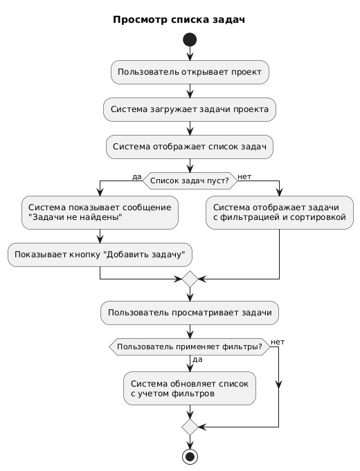
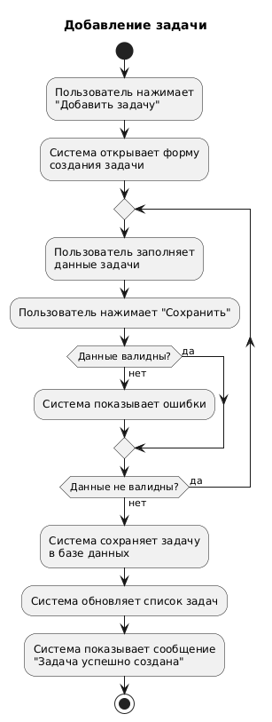
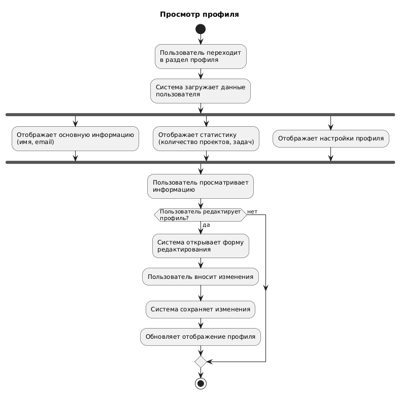

# 📊 Диаграммы активностей — Менеджер Проектов

## Содержание
1. [Просмотр списка задач](#1)
2. [Добавление задачи](#2)
3. [Просмотр профиля](#3)

---

### 1. Просмотр списка задач

---

### 2. Добавление задачи

---

### 3. Просмотр профиля

