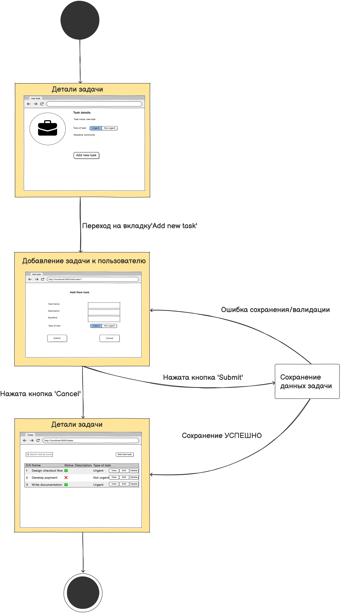

# Диаграмма состояний

# Содержание
1. [Добавление задачи](#1)
2. [Детали и просмотр задачи](#2)
3. [Просмотр всех задач](#3)

### 1. Добавление задачи

### 2. Детали и просмотри задачи

### 3. Просмотр всех задач

